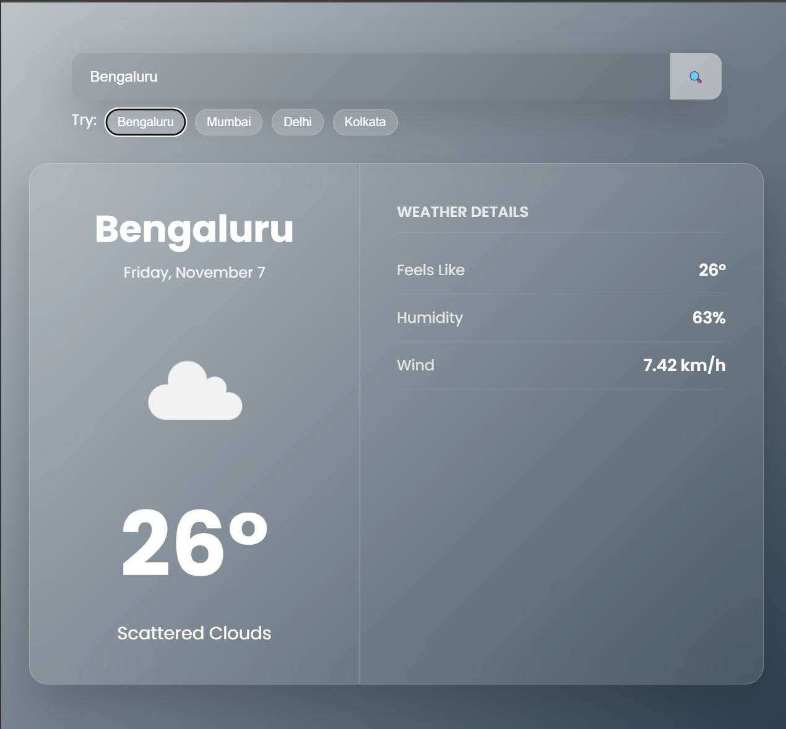

# 🌤️ Modern Weather App

A beautifully designed, responsive **Weather Dashboard** built using **HTML, CSS, and JavaScript** — powered by the **OpenWeatherMap API**.

---

## 🚀 Features
- 🌍 Search weather by city name
- 💨 Displays temperature, humidity, feels-like, and wind speed
- 🌈 Dynamic gradient background based on current weather
- 🪟 Glassmorphic UI with soft shadows and transitions
- ⚡ Real-time data from [OpenWeather API](https://openweathermap.org/api)
- 📱 Fully responsive design for mobile and desktop

---
## 🖼️ Preview

### ☁️ Weather Results  


### 🌤️ Search Page  


---

## 🧠 Tech Stack
- **Frontend:** HTML5, CSS3, Vanilla JavaScript  
- **API:** OpenWeatherMap API  
- **Design:** Glassmorphism + Gradient Backgrounds

---

## ⚙️ Setup & Usage

1. **Clone the repo**
   ```bash
   git clone https://github.com/YOUR-USERNAME/weather-app.git
   cd weather-app
